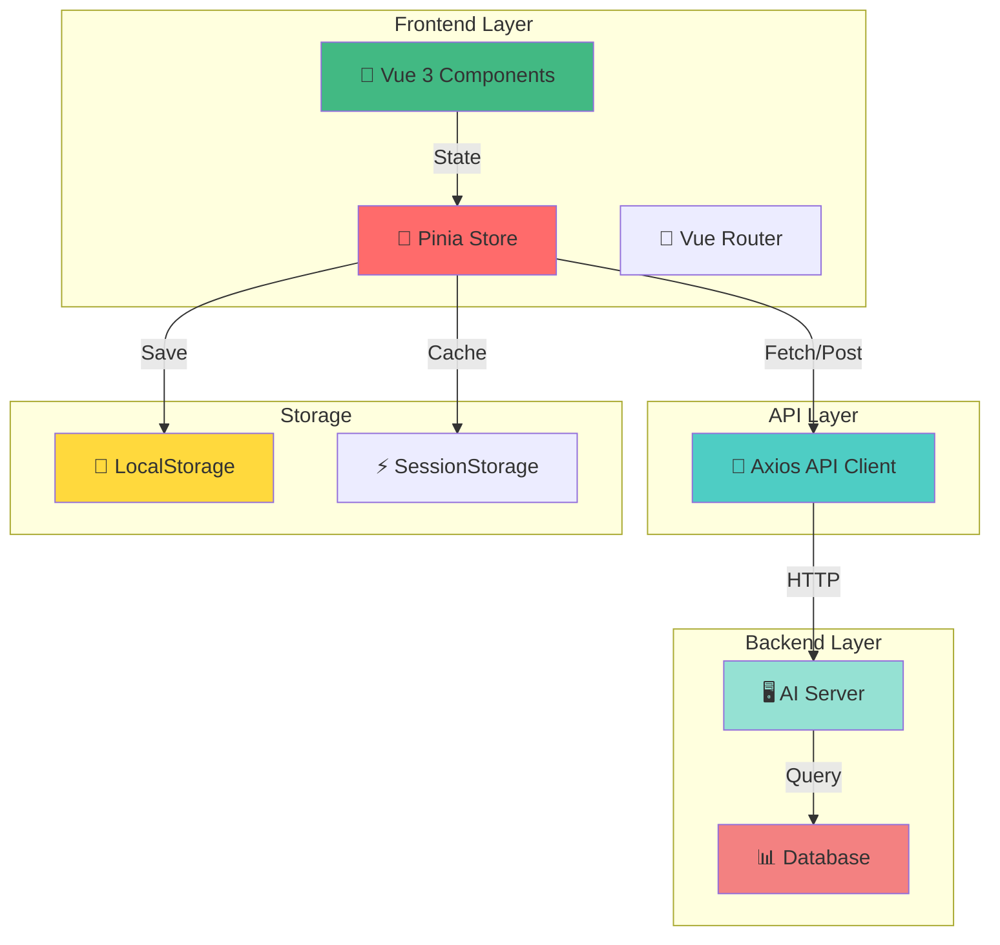
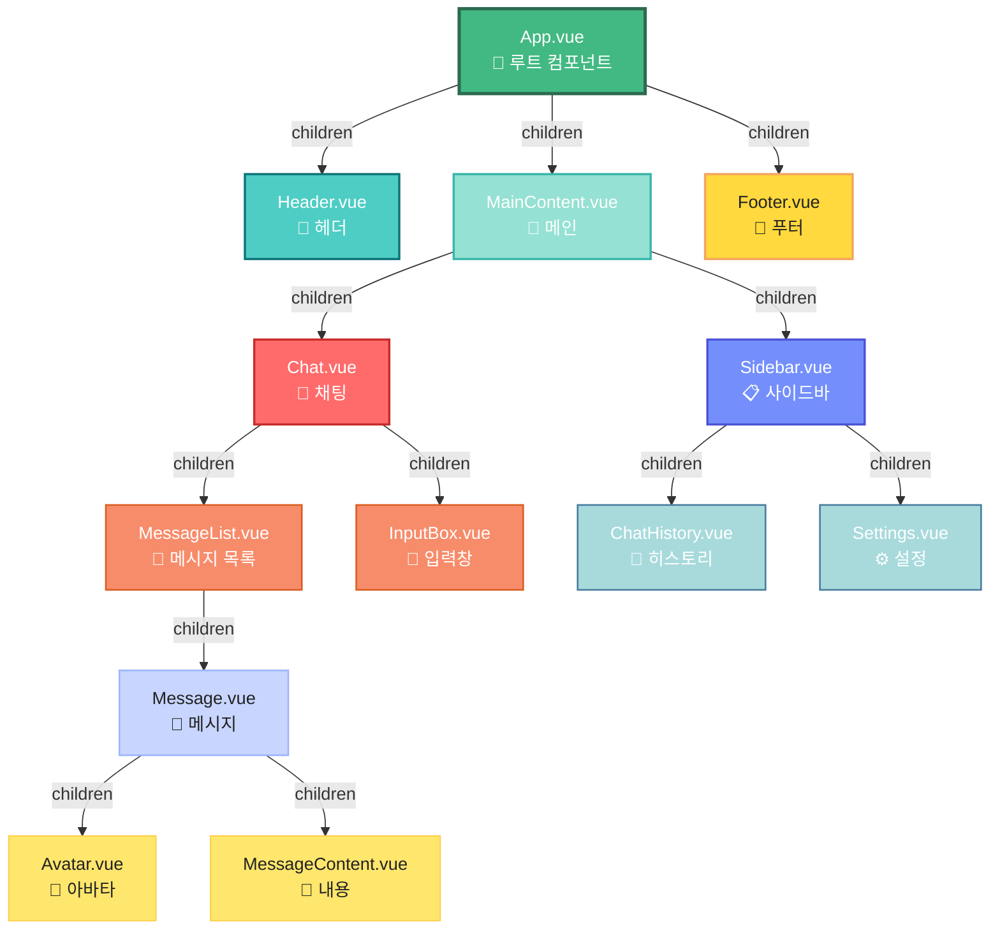
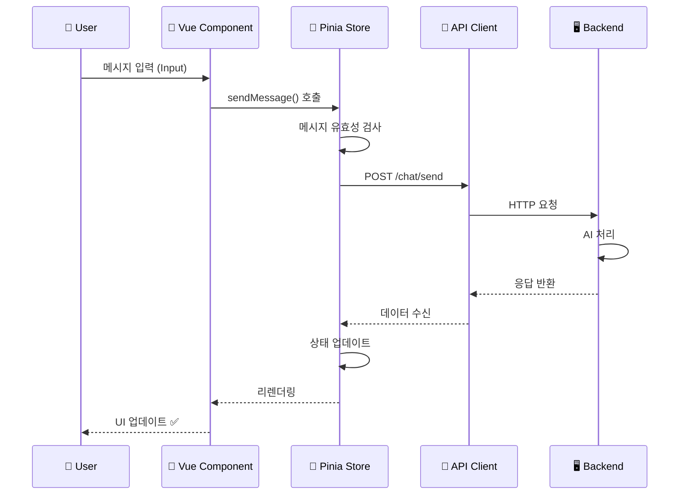

# 🤖 AI Lovable

> AI를 활용한 대화형 웹 애플리케이션으로, 자연스럽고 따뜻한 상호작용을 제공합니다.

[](LICENSE)
[](https://vuejs.org/)
[](https://github.com/zieeeuun/ai-lovable)

---

## 📋 목차

- [프로젝트 소개](#프로젝트-소개)
- [주요 기능](#주요-기능)
- [기술 스택](#기술-스택)
- [시스템 아키텍처](#시스템-아키텍처)
- [컴포넌트 구성도](#컴포넌트-구성도)
- [설치 및 실행](#설치-및-실행)
- [프로젝트 구조](#프로젝트-구조)
- [사용 예제](#사용-예제)
- [기여 방법](#기여-방법)
- [라이센스](#라이센스)

---

## 🎯 프로젝트 소개

**AI Lovable**은 현대적인 웹 기술과 인공지능을 결합한 프로젝트입니다. 사용자 친화적인 인터페이스로 AI와의 자연스러운 상호작용을 가능하게 하며, 따뜨하고 개인화된 경험을 제공합니다.

### 🎯 프로젝트 목표

| 목표 | 설명 |
|------|------|
| ✨ 우수한 UX | 직관적이고 아름다운 사용자 경험 제공 |
| 🎨 반응형 디자인 | 모든 디바이스에 최적화된 화면 |
| 🚀 빠른 성능 | 빠른 로딩 속도와 부드러운 애니메이션 |
| 🔒 보안 | 사용자 데이터 보호 및 안전성 |

---

## ✨ 주요 기능

| 기능 | 설명 | 상태 |
|------|------|------|
| 💬 **AI 대화** | 자연스러운 대화형 인터페이스 | ✅ |
| 🎨 **반응형 UI** | 모든 디바이스에서 최적화 | ✅ |
| 📱 **모바일 지원** | 모바일, 태블릿, 데스크톱 대응 | ✅ |
| ⚡ **실시간 처리** | 빠른 응답 속도 | ✅ |
| 💾 **상태 관리** | 효율적인 데이터 관리 | ✅ |
| 🌙 **다크 모드** | 야간 모드 지원 | 🔄 |
| 🌍 **다국어** | 다양한 언어 지원 | 🔄 |

---

## 🛠️ 기술 스택

### 📦 Frontend Framework
- **Vue.js 3.x** - Progressive 웹 프레임워크
- **Pinia** - 상태 관리
- **Axios** - HTTP 클라이언트

### 🎨 스타일링
- **HTML5** - 시맨틱 마크업
- **CSS3** - 현대적인 스타일링
- **Bootstrap 5** - CSS 프레임워크 (선택사항)

### 🔧 개발 도구
- **Vite** - 빌드 도구
- **Node.js** - 런타임 환경
- **npm/yarn** - 패키지 관리

### 📊 핵심 의존성

```json
{
  "dependencies": {
    "vue": "^3.x.x",
    "pinia": "^2.x.x",
    "axios": "^1.x.x"
  },
  "devDependencies": {
    "vite": "^4.x.x",
    "@vitejs/plugin-vue": "^4.x.x"
  }
}
```

### 📈 코드 구성 통계

| 언어 | 코드량 | 비중 | 📊 |
|------|--------|------|-----|
| Vue | 10,905 bytes | 65.2% | ████████████░░ |
| JavaScript | 3,453 bytes | 20.7% | █████░░░░░░░░ |
| HTML | 503 bytes | 3.0% | ░░░░░░░░░░░░░░ |
| CSS | 1,039 bytes | 6.2% | ██░░░░░░░░░░░░ |
| **합계** | **16,900 bytes** | **100%** | **███████████████** |

---

## 🏗️ 시스템 아키텍처



---

## 🎯 컴포넌트 구성도

### 전체 컴포넌트 구조



### 📨 데이터 흐름도



### ⚙️ 상태 관리 흐름

```mermaid
stateDiagram-v2
    [*] --> Idle
    
    Idle --> Loading: 메시지 전송
    Loading --> Processing: API 호출
    Processing --> Success: 응답 수신
    Processing --> Error: 에러 발생
    
    Success --> Idle: 메시지 저장
    Error --> Idle: 에러 처리
    
    Idle --> Typing: 입력 중
    Typing --> Idle: 입력 완료
    
    note right of Loading
        로딩 중...
        API 요청 진행
    end note
    
    note right of Success
        성공!
        메시지 추가
    end note
    
    note right of Error
        오류 발생
        재시도 가능
    end note
```



---

## 📦 설치 및 실행

### ✅ 필수 요구사항

```plaintext
✓ Node.js 16.0 이상
✓ npm 7.0 이상 또는 yarn 1.22 이상
✓ Git
```

### 🚀 설치 단계

**Step 1: 저장소 복제**
```bash
git clone https://github.com/zieeeuun/ai-lovable.git
cd ai-lovable
```

**Step 2: 의존성 설치**
```bash
npm install
# 또는
yarn install
```

**Step 3: 개발 서버 실행**
```bash
npm run dev
# 또는
yarn dev
```

**Step 4: 프로덕션 빌드**
```bash
npm run build
# 또는
yarn build
```

### ⚙️ 환경 설정

```bash
# .env 파일 생성
cp .env.example .env
```

```env
# .env 설정 파일
VITE_API_BASE_URL=https://api.example.com
VITE_APP_NAME=AI Lovable
VITE_APP_VERSION=1.0.0
VITE_API_TIMEOUT=30000
```

### 🔗 실행 후 접속

| 환경 | URL | 설명 |
|------|-----|------|
| 개발 | `http://localhost:5173` | Vite 개발 서버 |
| API | `http://localhost:3001` | API 서버 (json-server) |

---

## 📁 프로젝트 구조

```
ai-lovable/
├── src/
│   ├── components/              # 🎨 재사용 가능한 Vue 컴포넌트
│   │   ├── Chat.vue             # 메인 채팅 컴포넌트
│   │   ├── Message.vue          # 메시지 표시 컴포넌트
│   │   ├── InputBox.vue         # 입력창 컴포넌트
│   │   ├── Header.vue           # 헤더 컴포넌트
│   │   ├── Sidebar.vue          # 사이드바 컴포넌트
│   │   └── ...
│   │
│   ├── views/                   # 📄 페이지 컴포넌트
│   │   ├── Home.vue             # 홈 페이지
│   │   ├── ChatRoom.vue         # 채팅방 페이지
│   │   └── Settings.vue         # 설정 페이지
│   │
│   ├── stores/                  # 💾 Pinia 상태 관리
│   │   ├── chat.js              # 채팅 상태 스토어
│   │   ├── user.js              # 사용자 상태 스토어
│   │   └── app.js               # 앱 전역 상태 스토어
│   │
│   ├── api/                     # 🔌 API 요청 모듈
│   │   ├── chat.js              # 채팅 API
│   │   ├── user.js              # 사용자 API
│   │   └── axios.js             # Axios 설정
│   │
│   ├── styles/                  # 🎨 글로벌 스타일
│   │   ├── main.css             # 메인 스타일
│   │   ├── variables.css         # CSS 변수
│   │   └── animations.css        # 애니메이션
│   │
│   ├── utils/                   # 🛠️ 유틸리티 함수
│   │   ├── format.js            # 포맷팅 함수
│   │   ├── localStorage.js       # 로컬스토리지 유틸
│   │   └── helpers.js           # 헬퍼 함수
│   │
│   ├── router/                  # 🔀 Vue Router 설정
│   │   └── index.js             # 라우트 정의
│   │
│   ├── App.vue                  # 🌳 루트 컴포넌트
│   └── main.js                  # 🚀 애플리케이션 진입점
│
├── public/                      # 📦 정적 자산
│   ├── index.html               # HTML 진입점
│   └── favicon.ico              # 파비콘
│
├── .env.example                 # 환경 변수 템플릿
├── vite.config.js               # Vite 설정 파일
├── package.json                 # 프로젝트 메타데이터
├── package-lock.json            # 의존성 잠금 파일
└── README.md                    # 프로젝트 문서
```

---

## 💻 사용 예제

### 1️⃣ 기본 컴포넌트 사용

```vue
<!-- Chat.vue - 메인 대화 컴포넌트 -->
<template>
  <div class="chat-container">
    <div class="messages">
      <div v-for="msg in messages" :key="msg.id" class="message" :class="msg.type">
        {{ msg.text }}
      </div>
    </div>
    <div class="input-area">
      <input 
        v-model="userInput" 
        @keyup.enter="sendMessage"
        placeholder="메시지를 입력하세요..."
      />
      <button @click="sendMessage">전송</button>
    </div>
  </div>
</template>

<script setup>
import { ref } from 'vue'
import { useChatStore } from '@/stores/chat'

const chatStore = useChatStore()
const messages = ref([])
const userInput = ref('')

const sendMessage = async () => {
  if (!userInput.value.trim()) return
  
  const message = {
    id: Date.now(),
    text: userInput.value,
    type: 'user'
  }
  
  messages.value.push(message)
  
  // AI 응답 요청
  const response = await chatStore.sendMessage(userInput.value)
  messages.value.push({
    id: Date.now() + 1,
    text: response,
    type: 'ai'
  })
  
  userInput.value = ''
}
</script>

<style scoped>
.chat-container {
  display: flex;
  flex-direction: column;
  height: 100vh;
}

.messages {
  flex: 1;
  overflow-y: auto;
  padding: 20px;
}

.message {
  margin: 10px 0;
  padding: 10px 15px;
  border-radius: 8px;
}

.message.user {
  background-color: #007bff;
  color: white;
  text-align: right;
}

.message.ai {
  background-color: #f0f0f0;
  color: #333;
}

.input-area {
  display: flex;
  gap: 10px;
  padding: 20px;
  border-top: 1px solid #ddd;
}

.input-area input {
  flex: 1;
  padding: 10px;
  border: 1px solid #ddd;
  border-radius: 4px;
}

.input-area button {
  padding: 10px 20px;
  background-color: #007bff;
  color: white;
  border: none;
  border-radius: 4px;
  cursor: pointer;
}

.input-area button:hover {
  background-color: #0056b3;
}
</style>
```

### 2️⃣ API 요청 예제

```javascript
// api/chat.js - AI 채팅 API
import axios from 'axios'

const apiClient = axios.create({
  baseURL: import.meta.env.VITE_API_BASE_URL,
  timeout: import.meta.env.VITE_API_TIMEOUT || 30000
})

export const chatAPI = {
  // 메시지 전송
  sendMessage: async (message) => {
    try {
      const response = await apiClient.post('/chat', {
        message: message,
        timestamp: new Date().toISOString()
      })
      return response.data.reply
    } catch (error) {
      console.error('메시지 전송 실패:', error)
      throw error
    }
  },

  // 채팅 히스토리 조회
  getHistory: async (limit = 20) => {
    try {
      const response = await apiClient.get('/chat/history', {
        params: { limit }
      })
      return response.data.messages
    } catch (error) {
      console.error('채팅 히스토리 조회 실패:', error)
      throw error
    }
  },

  // 채팅 삭제
  deleteChat: async (chatId) => {
    try {
      await apiClient.delete(`/chat/${chatId}`)
      return true
    } catch (error) {
      console.error('채팅 삭제 실패:', error)
      throw error
    }
  }
}
```

### 3️⃣ 상태 관리 예제

```javascript
// stores/chat.js - Pinia 저장소
import { defineStore } from 'pinia'
import { ref, computed } from 'vue'
import { chatAPI } from '@/api/chat'

export const useChatStore = defineStore('chat', () => {
  // 상태
  const messages = ref([])
  const isLoading = ref(false)
  const error = ref(null)
  const currentChatId = ref(null)

  // 계산된 속성
  const messageCount = computed(() => messages.value.length)
  const hasError = computed(() => error.value !== null)

  // 메시지 전송
  const sendMessage = async (text) => {
    isLoading.value = true
    error.value = null

    try {
      const reply = await chatAPI.sendMessage(text)
      messages.value.push({
        id: Date.now(),
        text: text,
        type: 'user',
        timestamp: new Date()
      })
      messages.value.push({
        id: Date.now() + 1,
        text: reply,
        type: 'ai',
        timestamp: new Date()
      })
      return reply
    } catch (e) {
      error.value = e.message
      throw e
    } finally {
      isLoading.value = false
    }
  }

  // 메시지 조회
  const loadHistory = async (limit = 20) => {
    isLoading.value = true
    error.value = null

    try {
      const history = await chatAPI.getHistory(limit)
      messages.value = history
    } catch (e) {
      error.value = e.message
      throw e
    } finally {
      isLoading.value = false
    }
  }

  // 메시지 삭제
  const deleteMessage = async (messageId) => {
    try {
      await chatAPI.deleteChat(messageId)
      messages.value = messages.value.filter(msg => msg.id !== messageId)
    } catch (e) {
      error.value = e.message
      throw e
    }
  }

  // 모든 메시지 지우기
  const clearMessages = () => {
    messages.value = []
    error.value = null
  }

  return {
    messages,
    isLoading,
    error,
    currentChatId,
    messageCount,
    hasError,
    sendMessage,
    loadHistory,
    deleteMessage,
    clearMessages
  }
})
```

---

## 🖼️ 실행 화면

### 📱 데스크톱 홈 화면

```
┌─────────────────────────────────────────────────────┐
│ 🤖 AI Lovable                                 ☰     │
├─────────────────────────────────────────────────────┤
│                                                     │
│ 👤: 안녕하세요!                                      │
│ 14:25 ⏱️                                            │
│                                                     │
│ 🤖: 안녕하세요! 무엇을 도와드릴까요?                 │
│ 14:26 ⏱️                                            │
│                                                     │
│ 👤: 날씨가 어떻게 되나요?                            │
│ 14:27 ⏱️                                            │
│                                                     │
│ 🤖: 현재 지역의 날씨는 맑음이며 기온은 20°C입니다.  │
│ 14:28 ⏱️                                            │
│                                                     │
├─────────────────────────────────────────────────────┤
│ 입력: [━━━━━━━━━━━━━━━━━━━━━━━━━]  [📤 전송]      │
└─────────────────────────────────────────────────────┘
```

### 📱 모바일 반응형 뷰

```
┌──────────────────────┐
│ 🤖 AI Lovable  ☰     │
├──────────────────────┤
│                      │
│ 👤: 안녕!            │
│ 14:25 ⏱️             │
│                      │
│ 🤖: 반갑습니다!      │
│ 14:26 ⏱️             │
│                      │
│ 👤: 도와줘           │
│ 14:27 ⏱️             │
│                      │
│ 🤖: 무엇을           │
│     도와드릴까요?     │
│ 14:28 ⏱️             │
├──────────────────────┤
│ [메시지 입력]  [📤]   │
└──────────────────────┘
```

### 🌙 다크 모드 (테마)

```
┌─────────────────────────────────────────────────────┐
│ 🤖 AI Lovable (Dark Mode)                   ☀️      │
├─────────────────────────────────────────────────────┤
│                                                     │
│ 👤: 📝 사용자 메시지                                 │
│ └─ 14:30 ⏱️                                         │
│                                                     │
│ 🤖: 💬 AI 응답 메시지                               │
│ └─ 14:31 ⏱️                                         │
│                                                     │
│ 👤: 🤔 또 다른 질문                                 │
│ └─ 14:32 ⏱️                                         │
│                                                     │
├─────────────────────────────────────────────────────┤
│ 입력: [━━━━━━━━━━━━━━━━━━━━━━━━━]  [📤 전송]      │
└─────────────────────────────────────────────────────┘
```

### ⏳ 로딩 상태

```
┌─────────────────────────────────────────────────────┐
│ 🤖 AI Lovable                                 ☰     │
├─────────────────────────────────────────────────────┤
│                                                     │
│ 👤: 날씨 정보를 알려줘                               │
│                                                     │
│ 🤖: ⏳ AI가 응답을 준비 중입니다...                  │
│     [████████░░░░░░░░] 50%                         │
│                                                     │
├─────────────────────────────────────────────────────┤
│ 입력: [━━━━━━━━━━━━━━━━━━━━━━━━━]  [📤 전송]      │
└─────────────────────────────────────────────────────┘
```

---

## 🚀 성능 최적화

### ⚡ 로드 시간 최적화

| 최적화 방법 | 효과 |
|-----------|------|
| Vue 3 Composition API 활용 | 번들 크기 감소 |
| 코드 스플리팅 | 초기 로딩 속도 향상 |
| 이미지 최적화 및 레이지 로딩 | 네트워크 트래픽 감소 |
| 캐싱 전략 | 반복 접속 속도 개선 |

### 💾 메모리 관리

```javascript
// 컴포넌트 언마운트 시 정리
import { onBeforeUnmount } from 'vue'

onBeforeUnmount(() => {
  // 리스너 제거
  window.removeEventListener('resize', handleResize)
  
  // API 요청 취소
  cancelToken.cancel('Component unmounting')
  
  // 메모리 해제
  clearTimeout(timerId)
  clearInterval(intervalId)
})
```

---

## 🧪 테스트

```bash
# 📝 단위 테스트 실행
npm run test

# 🔄 E2E 테스트 실행
npm run test:e2e

# 📊 테스트 커버리지 확인
npm run test:coverage
```

---

## 🤝 기여 방법

### 🔄 기여 프로세스

1. 📌 이 저장소를 **포크**합니다
2. 🌳 기능 브랜치를 생성합니다 (`git checkout -b feature/AmazingFeature`)
3. 💾 변경사항을 커밋합니다 (`git commit -m 'Add some AmazingFeature'`)
4. 📤 브랜치에 푸시합니다 (`git push origin feature/AmazingFeature`)
5. 🔁 **Pull Request**를 생성합니다

### 📋 기여 가이드라인

| 항목 | 설명 |
|------|------|
| 📝 커밋 메시지 | 명확하고 설명적인 메시지 작성 |
| 🧹 코드 스타일 | ESLint 규칙 준수 및 일관성 유지 |
| ✅ 테스트 | 새 기능에 대한 테스트 작성 및 실행 |
| 📖 문서 | README 및 주석 업데이트 |

---

## 📄 라이센스

이 프로젝트는 [MIT License](LICENSE) 하에 라이센스됩니다.

```
MIT License

Permission is hereby granted, free of charge, to any person obtaining a copy
of this software and associated documentation files (the "Software"), to deal
in the Software without restriction, including without limitation the rights
to use, copy, modify, merge, publish, distribute, sublicense, and/or sell
copies of the Software, and to permit persons to whom the Software is
furnished to do so, subject to the following conditions:

The above copyright notice and this permission notice shall be included in all
copies or substantial portions of the Software.
```

---

## 👥 연락처

| 연락 방법 | 정보 |
|----------|------|
| 📧 이메일 | [your-email@example.com](mailto:your-email@example.com) |
| 💼 GitHub | [@zieeeuun](https://github.com/zieeeuun) |
| 🐦 Twitter | [@YourTwitter](https://twitter.com) |
| 💬 Discord | [커뮤니티 링크](https://discord.gg) |

---

## 🙏 감사의 말

이 프로젝트를 지원해주신 모든 분께 감사드립니다!

```
Contributors:
👤 zieeeuun - Creator & Maintainer
👥 [Your contributors here]
```

---

<div align="center">

### ⭐ 이 프로젝트가 도움이 되었다면 Star를 눌러주세요!

**Made with ❤️ by [zieeeuun](https://github.com/zieeeuun)**

[](https://github.com/zieeeuun)

</div>
